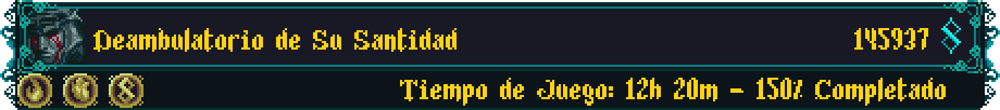
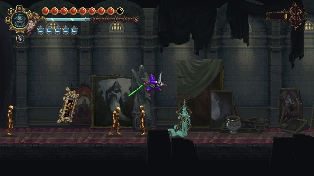

  
  
  <h2 align="center">-Senda del Tormento-</h2>

 

---

  
  
  

---

## Tabla de Contenidos

- [Créditos](https://github.com/NeonPixels/blasphemous.iter-tormenti/blob/main/README.es.md#creditos)
- [Información del mod](https://github.com/NeonPixels/blasphemous.iter-tormenti/blob/main/README.es.md#informacion-del-mod)
  - [Características](https://github.com/NeonPixels/blasphemous.iter-tormenti/blob/main/README.es.md#caracteristicas)  
  - [Notas importantes](https://github.com/NeonPixels/blasphemous.iter-tormenti/blob/main/README.es.md#notas-importantes)
- [Instalación](https://github.com/NeonPixels/blasphemous.iter-tormenti/blob/main/README.es.md#instalacion)
- [Enlaces](https://github.com/NeonPixels/blasphemous.iter-tormenti/blob/main/README.es.md#enlaces)

---

## Creditos

- Ayuda de programación e inspiración - [BrandenEK](https://github.com/BrandenEK)
- Código de utilidades FSM basadas en [Satchel](https://github.com/PrashantMohta/Satchel)

Agradecimientos especiales a toda la gente del Discord de Modding de Blasphemous por su apoyo.

---

## Informacion del mod

Iter Tormenti (Senda del Tormento) es una modificación (mod) de [Blasphemous](https://thegamekitchen.com/blasphemous/) pensada para quienes quieran experimentar todo lo que el juego tiene que ofrecer en una sola partida, sin que sea necesario ascender y reiniciar en modo Verdadero Calvario.

  

### Caracteristicas

- Las Ranuras de Partida Vacías pueden ser ascendidas, permitiendo comenzar el juego directamente en modo Verdadero Calvario, otorgando acceso a las misiones de las Amanecidas, así como al altar de Penitencias. Ten cuidado, pues este modo presenta un desafío considerable.
- En el Altar de Penitencias, se puede escoger una de las siguientes nuevas penitencias:
  - `Penitencia de la Fe Sangrante`: Combina los efectos y recompensas de las penitencias de el Corazón Sangrante y la Fe Inquebrantable.
  - `Penitencia del Corazon Culpable`: Combina los efectos y recompensas de las penitencias de el Corazón Sangrante y la Culpa Auténtica.
  - `Penitencia de la Culpa Inquebrantable`: Combina los efectos y recompensas de las penitencias de la Culpa Auténtica y la Fe Inquebrantable.
  - `Penitencia de la Senda del Tormento`: Combina los efectos y recompensas de las tres penitencias básicas.
- Completar una penitencia combinada también marcará como completadas las penitencias asociadas.
- La Campanilla Petrificada puede ser obtenida en una partida no ascendida, activando así las misiones de las Amanecidas. Tened cuidado, las Amanecidas están equilbradas para el modo Verdadero Calvario, y presentarán un considerable desafio en una partida no ascendida.
- El enfrentamiento con Esdras siempre tendrá lugar, aun si se tiene el Escapulario Incompleto, pero el desenlace cambiará, permitiendo llegar al final C.

  

### Notas importantes

- Solo funciona con la versión más reciente del juego: `4.0.67`
- Al combinar los efectos de las penitencias de el `Corazón Sangrante` y la `Culpa Auténtica`, usar los Matraces Biliares rellenará el Fervor, y también hará que la Salud se rellene paulatinamente. Esto es intencional, dado que el mismo efecto tiene lugar en el juego base cuando se equipan las cuentas de rosario obtenidas como recompensa de dichas penitencias: El `Relicario del Corazón Sufrido` y el `Relicario del Compungido Corazón`
- Este mod ofrece la oportunidaqd de completar todo en una sola partida, pero no lo garantiza. Los objetivos del juego pueden fracasar si no se completan de forma correcta. Por ejemplo, enfrentarse a Esdras sin el Escapulario Incompleto resultará en su muerte, haciendo imposible obtener el final C en esa partida.

---

## Instalacion

Instalador de Mods:
- El mod puede ser instalado usando [Blasphemous Modding Installer](https://github.com/BrandenEK/Blasphemous.Modding.Installer)

Instalación manual:
1. Comprueba los requisitos de la ultima entrega del mod en la página de [Entregas](https://github.com/NeonPixels/blasphemous.iter-tormenti/releases)
2. Descarga la versión requerida de la [Modding API](https://github.com/BrandenEK/Blasphemous-Modding-API/releases)
3. Sigue las instrucciones allí sobre como instalar la API, toma nota de la ubicación de la carpeta `Modding`
4. Descarga la versión requerida de la [Penitence Framework](https://github.com/BrandenEK/Blasphemous.Framework.Penitence/releases)
5. Descomprime los contenidos de el archivo `PenitenceFramework.zip` dentro de la carpeta `Modding`
6. Descarga la versión requerida de la [Level Framework](https://github.com/BrandenEK/Blasphemous.Framework.Levels/releases)
7. Descomprime los contenidos de el archivo `LevelFramework.zip` dentro de la carpeta `Modding`
8. Descarga la ultima entrega del mod de la página de [Entregas](https://github.com/NeonPixels/blasphemous.iter-tormenti/releases)
9. Descomprime los contenidos de el archivo `IterTormenti.zip` dentro de la carpeta `Modding`

Desinstalación manual:
Elimina los siguientes archivos y carpetas de la carpeta `Modding`:
- `plugins\IterTormenti.dll`
- `data\IterTormenti\`
- `levels\IterTormenti\`
- `localitazion\IterTomenti.txt`

<b>Nota:</b> Cuando se actualiza manualmente a una nueva versión del mod, se recomienda eliminar manialmente los archivos de la versión anterior, dado que si hay archivos que se han eliminado de la nueva versión, estos no será eliminados automaticamente al instalar manualmente.

---

## Enlaces

- [Página Oficial de Blasphemous](https://thegamekitchen.com/blasphemous/)
- [Servidor de Discord de Blasphemous](https://discord.gg/Blasphemous)

---

  

