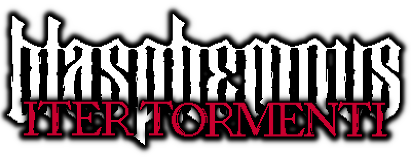
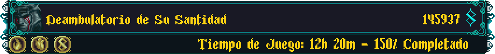

  
  
  <h2 align="center">-Path of Torment-</h2>

---

  
  
  

---

## Table of Contents

- [Credits](https://github.com/NeonPixels/blasphemous.iter-tormenti#credits)
- [Mod info](https://github.com/NeonPixels/blasphemous.iter-tormenti#mod-info)
  - [Features](https://github.com/NeonPixels/blasphemous.iter-tormenti#features)
  - [Important notes](https://github.com/NeonPixels/blasphemous.iter-tormenti#important-notes)
- [Installation](https://github.com/NeonPixels/blasphemous.iter-tormenti#installation)
- [Links](https://github.com/NeonPixels/blasphemous.iter-tormenti#links)

---

## Credits

- Coding help & inspiration - [BrandenEK](https://github.com/BrandenEK)
- FSM utils code based on [Satchel](https://github.com/PrashantMohta/Satchel)

And a very special thanks to all the members of the Blasphemous Modding Discord for their support.

---

## Mod info

Iter Tormenti (Path of Torment) is a modification (mod) for [Blasphemous](https://thegamekitchen.com/blasphemous/), meant for those who want to experience all that the game has to offer in a single playthrough, without needing to ascend and restart in True Torment mode.

  

### Features

- Empty Save Slots can be ascended, thus beginning the game directly in True Torment mode, granting access to the Amanecidas questline, as well as the Penitence altar. Beware, as this mode presents a considerable challenge.
- At the Penitece Altar, one of the following new penitences can be selected:
  - `Penitence of the Bleeding Faith`: Combines the effects and rewards of the Bleeding Heart and the Unwavering Faith penitences.
  - `Penitence of the Guilty Heart`: Combines the effects and rewards of the Bleeding Heart and the True Guilt penitences.
  - `Penitence of the Unwavering Guilt`: Combines the effects and rewards of the Unwavering Faith and the True Guilt penitences.
  - `Penitence of the Path of Torment`: Combines the effects and rewards of all three of the basic penitences.
- Completing a combined penitence will also award completion of the penitences involved.
- The Petrified Bell can now be obtained in a non-ascended playthrough, thus enabling the Amanecidas questline. Beware, as the Amanecidas are balanced for True Torment mode, and will pose a significant challenge in a non-Ascended game.
- The fight with Esdras will always happen, even if the player has the Incomplete Scapular, but the conclusion of the encounter will change, leading to the C ending.

  

### Important notes

- Only works on the most current game version: `4.0.67`
- When combining the effects of the `Bleeding Heart` and `True Guilt` penitences, using Bile Flasks will refill Fervour, and will also gradually refill Health. This is intended, as the same effect happens in the base game when equipping the rosary beads awarded by completing those penitences: `Reliquary of the Suffering Heart` and `Reliquary of the Sorrowful Heart`
- This mod will offer the chance to complete everything in a single run, but will not guarantee it. Quests can still be failed if not done properly. For example, facing Esdras without the Incomplete Scapular will result in his demise, making it impossible to obtain the C ending in that playthrough.

---

## Installation

Mod Installer:
- The mod can be installed via the [Blasphemous Modding Installer](https://github.com/BrandenEK/Blasphemous.Modding.Installer)

Manual installation:
1. Check the requirements for the latest release of the mod from the [Releases](https://github.com/NeonPixels/blasphemous.iter-tormenti/releases) page
2. Download the required release of the [Modding API](https://github.com/BrandenEK/Blasphemous-Modding-API/releases)
3. Follow the instructions there on how to install the API, take note of the location of the `Modding` folder
4. Download the required release of the [Penitence Framework](https://github.com/BrandenEK/Blasphemous.Framework.Penitence/releases)
5. Extract the contents of the `PenitenceFramework.zip` file into the `Modding` folder
6. Download the required release of the [Level Framework](https://github.com/BrandenEK/Blasphemous.Framework.Levels/releases)
7. Extract the contents of the `LevelFramework.zip` file into the `Modding` folder
8. Download the latest release of the mod from the [Releases](https://github.com/NeonPixels/blasphemous.iter-tormenti/releases) page
9. Extract the contents of the `IterTormenti.zip` file into the `Modding` folder

Manual removal:
Remove the following files and folders from the `Modding` folder:
- `plugins\IterTormenti.dll`
- `data\IterTormenti\`
- `levels\IterTormenti\`
- `localitazion\IterTomenti.txt`

<b>Note:</b> When manually updating the mod to a new version, it is recommended to manually remove the previous mod files first, as files that might have been removed from the mod release won't be removed automatically.

---

## Links

- [Blasphemous Official Site](https://thegamekitchen.com/blasphemous/)
- [Blasphemous Discord Server](https://discord.gg/Blasphemous)

---

  

